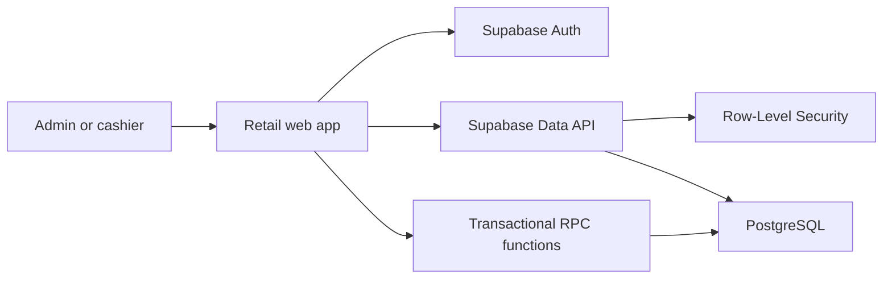

# Architecture

## Overview

The client-rendered React application is hosted through OpenAI Sites. Supabase provides authentication, PostgreSQL storage, Row-Level Security and transactional functions.

Each product has a global catalogue record and one `branch_products` record per location. The branch record owns its selling price, available quantity, reorder level and sale availability.

## Checkout flow

1. The cashier signs in through Supabase Authentication.
2. The application retrieves active products permitted by RLS.
3. The cashier builds a cart locally.
4. `complete_branch_sale` validates the selected branch inventory and pricing.
5. The same transaction deducts inventory and records stock movements.
6. If any item has insufficient stock, the complete transaction rolls back.

## Inventory adjustment flow

1. An authenticated user selects a product and movement type.
2. The application calls `change_branch_stock`.
3. The function prevents negative inventory.
4. The product balance and movement audit record are committed together.

## Stock transfer flow

1. An administrator selects a destination and one or more products.
2. `send_stock_transfer` validates availability and deducts source inventory atomically.
3. The transfer remains `in_transit`; destination inventory is unchanged.
4. At the receiving branch, an administrator confirms receipt.
5. `receive_stock_transfer` increases destination inventory and records transfer-in movements.

## Purchasing and expiry flow

1. An administrator creates a supplier and a branch purchase order.
2. Each delivery records only the quantities received; partial orders stay open.
3. Receiving updates branch inventory and the product's latest unit cost atomically.
4. Lot number and expiry date are optional for each received line.
5. Checkout reduces tracked lots using first-expiry-first-out (FEFO).
6. Stock transfers preserve tracked lot and expiry details between branches.

## Reporting flow

1. The user selects a date range and permitted branch scope.
2. `get_sales_dashboard` aggregates sales, products, payments and operating alerts in PostgreSQL.
3. Administrators may report across all branches and view estimated gross profit.
4. Cashiers are restricted to their own sales at an assigned branch.
5. CSV export uses the same Row-Level Security restrictions as the dashboard.

## Receipt flow

1. Checkout returns the newly created sale identifier.
2. `get_sale_receipt` verifies branch and cashier permissions.
3. The application renders the transaction in 58 mm or 80 mm thermal format.
4. Sales History uses the same sales policies for secure receipt reprinting.

## Return and refund flow

1. Staff locate the original sale by receipt number and select return quantities.
2. `create_return_request` validates the original items and prior returns.
3. The request remains pending without changing inventory or the original sale.
4. An administrator approves or rejects the request.
5. Approved sellable returns increase branch inventory; damaged and expired items remain unavailable.
6. The return record and printable receipt preserve the complete decision trail.

## Cashier shift flow

1. A cashier opens one shift at an assigned branch and enters the counted starting float.
2. Checkout requires that open shift and links every sale to it.
3. Cash additions and payouts are recorded with an amount and reason.
4. The summary separates cash, card and GCash sales and deducts approved cash refunds.
5. The cashier enters the physical closing count; PostgreSQL calculates the over or short amount atomically.
6. Administrators review closed shifts, add review notes and can print the reconciliation summary.

## Stocktake flow

1. An administrator starts a branch stocktake, capturing system quantities for all active products.
2. Assigned branch staff search or scan products and save physical counts with optional notes.
3. All products must be counted before the session can be submitted and locked.
4. An administrator reviews the variances and either cancels or posts the session.
5. Posting atomically replaces branch balances, records variance movements and reconciles available inventory lots.
6. Posted and cancelled sessions remain in the branch audit history.

## Reorder planning flow

1. `get_reorder_suggestions` calculates average daily product sales from the previous 30 days.
2. The selected coverage window determines target stock, with twice the product reorder level as the minimum target.
3. Usable stock excludes near-expiry units; open orders and incoming transfers reduce the suggested quantity.
4. An administrator selects quantities and assigns preferred suppliers.
5. `create_reorder_draft_orders` groups selected products into one draft purchase order per supplier.
6. Drafts are reviewed and confirmed in Purchasing before receiving is permitted.

## Expense flow

1. Staff record a branch expense with category, payment method, date, payee and supporting reference.
2. Cash expenses require the submitter's open cashier shift and create a linked cash-out movement.
3. Administrator entries are approved immediately; cashier entries remain pending for review.
4. Rejected cash expenses create a cash-in reversal while the original shift is still open.
5. Permission-aware summaries group approved costs by category and payment method.
6. The dashboard estimates operating result as gross profit minus approved expenses.

## Source layout

- `app/`: interface and styling
- `lib/supabase.ts`: Supabase browser client
- `supabase/migrations/`: ordered database migrations
- `docs/`: project documentation
- `.openai/hosting.json`: Sites project identity

## Current limitations

- Transfer discrepancies and cancellations are not yet supported.
- The application requires internet connectivity.
- There is no automated end-to-end test suite yet.
