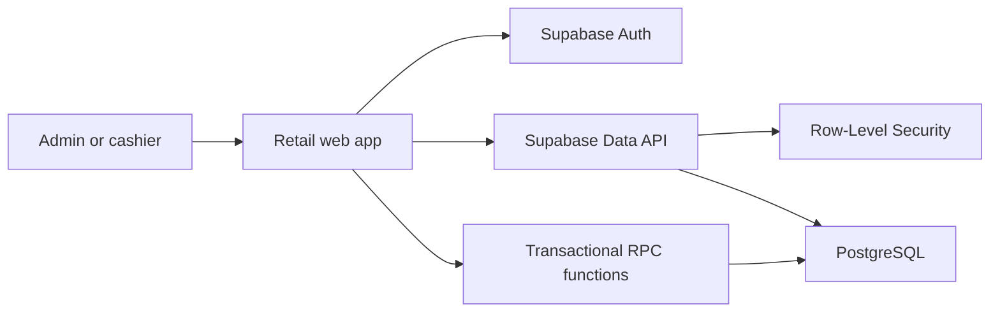

# Architecture

## Overview

The client-rendered React application is hosted through OpenAI Sites. Supabase provides authentication, PostgreSQL storage, Row-Level Security and transactional functions.

## Checkout flow

1. The cashier signs in through Supabase Authentication.
2. The application retrieves active products permitted by RLS.
3. The cashier builds a cart locally.
4. `complete_sale` validates inventory and creates the sale and sale items.
5. The same transaction deducts inventory and records stock movements.
6. If any item has insufficient stock, the complete transaction rolls back.

## Inventory adjustment flow

1. An authenticated user selects a product and movement type.
2. The application calls `change_stock`.
3. The function prevents negative inventory.
4. The product balance and movement audit record are committed together.

## Source layout

- `app/`: interface and styling
- `lib/supabase.ts`: Supabase browser client
- `supabase/migrations/`: ordered database migrations
- `docs/`: project documentation
- `.openai/hosting.json`: Sites project identity

## Current limitations

- All authenticated users currently have the same database permissions.
- Product editing and deactivation are not yet exposed.
- Inventory value currently uses selling price, not acquisition cost.
- The application requires internet connectivity.
- There is no automated end-to-end test suite yet.
