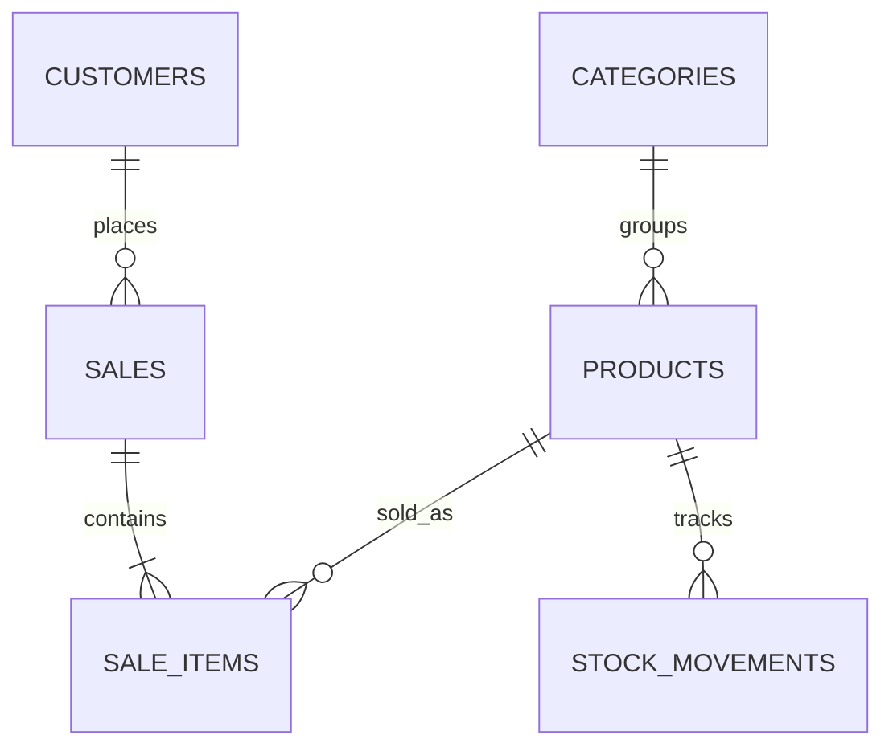

# Database

## Core tables

| Table | Purpose |
| --- | --- |
| `categories` | Product grouping |
| `products` | SKU, price, cost, stock balance and reorder level |
| `customers` | Optional customer details |
| `sales` | Transaction header, total, payment method and cashier |
| `sale_items` | Products and quantities included in each sale |
| `stock_movements` | Immutable inventory audit events |
| `profiles` | Staff identity, role and active status |
| `branches` | Store locations |
| `staff_branch_assignments` | Staff-to-branch access |
| `branch_products` | Branch-specific price, quantity, reorder level and status |
| `stock_transfers` | Transfer header, route, status and send/receipt audit data |
| `stock_transfer_items` | Products and quantities included in a transfer |
| `suppliers` | Supplier identity and contact information |
| `purchase_orders` | Branch order header, supplier and receiving status |
| `purchase_order_items` | Ordered, received and outstanding product quantities |
| `inventory_lots` | Optional lot, expiry, cost and remaining quantities |
| `stock_transfer_item_lots` | Expiry lots carried between branches during transfers |

## Relationships

## Inventory rules

- `products.quantity_on_hand` stores the current balance for fast checkout.
- Every sale or manual change also creates a `stock_movements` record.
- `complete_sale` locks products, validates stock and writes all sale records atomically.
- Manual changes use `change_stock`; users should not directly overwrite stock.
- Stock cannot become negative.
- Sales and stock movements always identify the responsible branch.
- A product can have different selling prices and inventory balances by branch.
- Sending a transfer deducts source stock; destination stock increases only through `receive_stock_transfer`.
- Purchase receipts increase stock only by the quantity received and support partial delivery.
- Tracked lots are reduced earliest-expiry-first during checkout.
- `get_sales_dashboard` returns permission-aware sales and operating aggregates without exposing unrestricted transaction data.

## Security

Row-Level Security is enabled for each application table. Current policies allow authenticated staff to manage products, categories and customers and read transaction history. Inserts into sales and inventory history are controlled through authenticated database functions.

Administrators can manage products, inventory and staff access. Cashiers can complete sales but cannot change stock or roles. New Supabase users receive the cashier role automatically.

## Migration policy

Migrations are immutable after use in a shared environment. Future database changes must be added as a new numbered SQL file rather than modifying an applied migration.
